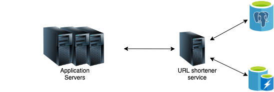

# url-shortener
Welcome to the url-shortener app!

_"Try and leave this world a little better than you found it, and when your turn comes to die, you can die happy in feeling that at any rate, you have not wasted your time but have done your best." Robert Baden-Powell_

## Project Overview



Response body content-type is always `application/json`.

Trying to summarize what the system does in plain words:

*Web service to create short "aliases" (short links) for lengthy URLs.*

## Endpoints

### Create
Create a new short url.

### Get
Redirect by a short url.

### Update
updates a stored URL.

## Docs:

### Postman Collection:
- Import the postman [collections](https://github.com/alexmourapb/url-shortener/tree/main/docs/postman)

### HTTP API Documentation
Run the project and access
We have a Swagger page!
- Files: [Swagger](https://github.com/alexmourapb/url-shortener/tree/main/docs/swagger)
- Locally: run the project and access http://localhost:8000/docs/v1/swagger/index.html

## Project Decisions

### Project design

```
.
├── cmd # everything starts here: main files are located here
├── docs # autogenerated and handcrafted files aimed at docs (ex. swagger/postman collections)
├── app
│   ├── domain
│   │    ├── shortener
│   │    │   ├── usecases # domain usecases (https://martinfowler.com/bliki/UseCase.html)
│   │    │   ├── entities # our domain entities and aggregates
│   │    │   ├── vos # Value Objects package (https://martinfowler.com/bliki/ValueObject.html)
│   └── gateways
│           ├── http # HTTP API infrastructure layer
│           └── db # database infrastructure layer
├──
```

## Repository Design

We chose a Repository Design that was widely discussed among the team, guided by the principles of `screaming architecture` and
`package by feature`

- [Package by Feature (Philipp Hauer)](https://phauer.com/2020/package-by-feature/)
- [Screaming Architecture (Uncle Bob)](https://blog.cleancoder.com/uncle-bob/2011/09/30/Screaming-Architecture.html)
- [I'll take pkg over internal (Travis Jefferey)](https://travisjeffery.com/b/2019/11/i-ll-take-pkg-over-internal/)

## Dependencies

#### Redis
> https://redis.io/commands

#### Postgres
> https://www.postgresql.org/docs/ 

#### Router Gorilla/Mux:
- github.com/gorilla/mux v1.8.0

#### Middleware manager:
- github.com/urfave/negroni v1.0.0

#### Zerolog Logger:
- github.com/rs/zerolog v1.26.0

#### Validator:
- github.com/go-playground/validator v9.31.0+incompatible

#### Config File:
- github.com/kelseyhightower/envconfig v1.4.0

#### Linter:
- https://github.com/golangci/golangci-lint

Tests:
- github.com/stretchr/testify v1.7.0

Swagger Swag:
- We're using [swaggo/swag](https://github.com/swaggo/swag) to auto-generate swagger documentation based on comments.
  Everytime a handler is created or updated, its documentation should be added/updated using the
  [Declarative Comments Format](https://github.com/swaggo/swag#declarative-comments-format).
